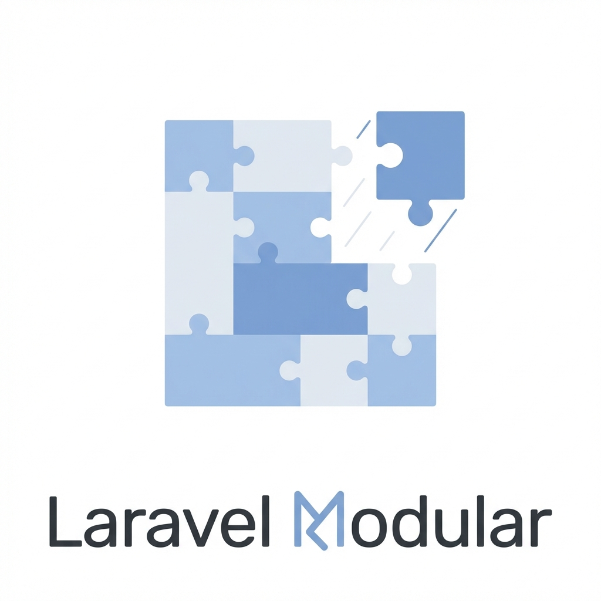

# Laravel Modular 🚀



[](https://packagist.org/packages/alizharb/laravel-modular)
[](https://github.com/alizharb/laravel-modular/actions?query=workflow%3ATests+branch%3Amain)
[](https://github.com/alizharb/laravel-modular/actions?query=workflow%3APHPStan+branch%3Amain)
[](https://packagist.org/packages/alizharb/laravel-modular)
[](https://packagist.org/packages/alizharb/laravel-modular)

**Laravel Modular** is a professional, framework-agnostic modular system engineered for Laravel 11/12. It empowers you to build scalable, strictly typed, and decoupled applications with zero configuration overhead.

We override 29+ native Artisan commands to provide a seamless "first-class" modular experience, feeling exactly like standard Laravel but better.

## ✨ Features

- 🏗️ **Native Experience**: 29+ Artisan commands (`make:model`, `make:controller`, etc.) fully support `--module`.
- ⚡ **Zero Config Autoloading**: Intelligent `composer-merge-plugin` integration for isolated module dependencies.
- 🚀 **Performance First**: Built-in discovery caching (`modular:cache`) for near-zero overhead in production.
- 🔄 **Dynamic Activation**: Enable or disable modules on the fly via `module:enable` and `module:disable`.
- 🔍 **Auto-Discovery**: Automatic registration of Artisan commands, Policies, and Event Listeners within modules.
- 🔌 **Decoupled Architecture**: Strictly typed `ModuleRegistry` and traits for maximum stability.
- 🛠️ **Full Customizability**: Publishable stubs, dynamic config paths, and global helpers.
- ✅ **Laravel 11 & 12 Ready**: Optimized for PHP 8.2+ and the latest framework features.
- 🎨 **Asset Management**: Seamless Vite integration via `modular_vite()` and asset linking.

---

## 🚀 Installation

Install the package via Composer:

```bash
composer require alizharb/laravel-modular
```

Run the installation command to automatically configure your application:

```bash
php artisan modular:install
```

> **Note**: This will automatically install and configure `wikimedia/composer-merge-plugin` to handle your module dependencies.

---

## 📖 Usage

### Creating a Module

Generate a fully structured module in seconds:

```bash
php artisan make:module Blog
```

### Generating Resources

Every standard Laravel `make:` command acts as a modular command when you pass the `--module` flag:

```bash
# Create a Model with Migration, Controller, and Factory in 'Blog' module
php artisan make:model Post --module=Blog -mcf

# Create a resource controller
php artisan make:controller API/PostController --module=Blog --api
```

### Modular Database

Run migrations and seeders specifically for your modules:

```bash
# Migrate all modules
php artisan modular:migrate

# Migrate a specific module
php artisan modular:migrate Blog --fresh --seed

# Run module seeders
php artisan modular:seed Blog

# Check for circular dependencies
php artisan modular:check

# Debug module configuration
php artisan modular:debug Blog

# Run module tests
php artisan modular:test Blog
```

### Middleware & Config

Define middleware in your `module.json`:

```json
"middleware": {
    "web": ["Modules\\Blog\\Http\\Middleware\\TrackVisits"],
    "blog.admin": "Modules\\Blog\\Http\\Middleware\\AdminGuard"
}
```

Access config case-insensitively:

```php
// Both work!
config('Blog::settings.key');
config('blog::settings.key');
```

---

## 🛠️ Helpers & Assets

### Global Helpers

Access module information globally with strictly typed helpers:

```php
// Get the registry or specific module config
$modules = module(); 
$blogConfig = module('Blog');

// Get absolute path to a resource
$viewPath = module_path('Blog', 'Resources/views');

// Get absolute path to a config file
$configPath = module_config_path('Blog', 'settings.php');
```

### Asset Management

Link your module assets to `public/modules` for easy serving:

```bash
php artisan modular:link
```

Use the helper to generate asset URLs in your Blade views:

```blade
<link rel="stylesheet" href="{{ module_asset('Blog', 'css/app.css') }}">

```

---

## ⚙️ Configuration

Publish the configuration file for advanced customization:

```bash
php artisan vendor:publish --tag="modular-config"
```

You can customize:
- **Paths**: Move modules to `packages/` or any custom directory.
- **Stubs**: Enable custom stubs to strictly enforce your team's coding standards.
- **Composer**: Set default fields (`vendor`, `author`, `license`) for generated `composer.json` files.

---

## 🧪 Testing

We strictly enforce testing. Use the provided test suite to verify your modules:

```bash
vendor/bin/pest
```

---

## 💖 Sponsors

We would like to extend our thanks to the following sponsors for funding Laravel Modular development. If you are interested in becoming a sponsor, please visit the [Laravel Modular GitHub Sponsors page](https://github.com/sponsors/alizharb).

---

## 🤝 Contributing

We welcome contributions! Please see [CONTRIBUTING](.github/CONTRIBUTING.md) for details.

1. Fork the Project
2. Create your Feature Branch (`git checkout -b feature/AmazingFeature`)
3. Commit your Changes (`git commit -m 'Add some AmazingFeature'`)
4. Push to the Branch (`git push origin feature/AmazingFeature`)
5. Open a Pull Request

---

## 🌟 Acknowledgments

- **Laravel**: For creating the most elegant PHP framework.
- **Spatie**: For setting the standard on Laravel package development.

---

## 🔒 Security

If you discover any security-related issues, please email **Ali Harb** at [harbzali@gmail.com](mailto:harbzali@gmail.com).

## 📄 License

The MIT License (MIT). Please see [License File](LICENSE.md) for more information.

---

<p align="center">
    Made with ❤️ by <strong>Ali Harb</strong>
</p>
