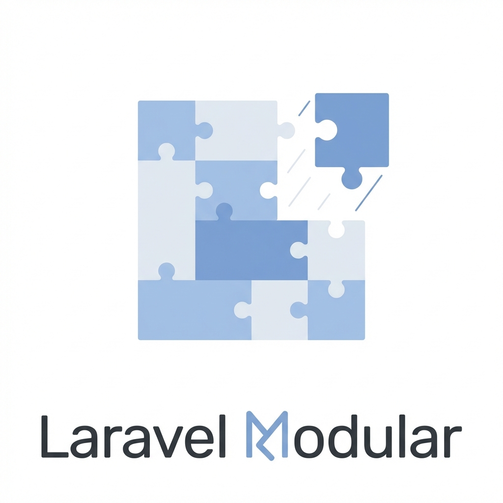

# Laravel Modular 🚀



[](https://packagist.org/packages/alizharb/laravel-modular)
[](https://github.com/alizharb/laravel-modular/actions?query=workflow%3ATests+branch%3Amain)
[](https://github.com/alizharb/laravel-modular/actions?query=workflow%3APHPStan+branch%3Amain)
[](https://packagist.org/packages/alizharb/laravel-modular)
[](https://packagist.org/packages/alizharb/laravel-modular)

**Laravel Modular** is a professional, framework-agnostic modular system engineered for Laravel 11/12/13. It empowers you to build scalable, strictly typed, and decoupled applications with zero configuration overhead.

We override 29+ native Artisan commands to provide a seamless "first-class" modular experience, feeling exactly like standard Laravel but better.

## ✨ Features

- 🏗️ **Native Experience**: 29+ Artisan commands (`make:model`, `make:controller`, etc.) fully support `--module`.
- ⚡ **Zero Config Autoloading**: Intelligent `composer-merge-plugin` integration for isolated module dependencies.
- 🚦 **Topological Sorting**: Strict dependency graph resolution ensures base modules always boot before their dependents.
- 🚀 **Performance First**: Built-in discovery caching (`modular:cache`) for near-zero overhead in production.
- 🔄 **Dynamic Activation**: Enable or disable modules on the fly via `module:enable` and `module:disable`.
- 🔍 **Auto-Discovery**: Automatic registration of Artisan commands, Policies, and Event Listeners within modules.
- 🔌 **Decoupled Architecture**: Strictly typed `ModuleRegistry` and traits for maximum stability.
- 🧭 **Production Diagnostics**: `modular:doctor`, `modular:status`, `modular:debug`, `modular:graph`, and `modular:why` make module state transparent.
- 🧠 **Laravel Boost Ready**: Ships package guidelines and a dedicated Boost skill for AI-assisted modular development.
- 🧩 **Migration Friendly**: Includes `modular:import-nwidart` to preview and migrate nwidart-style modules.
- ✅ **Laravel 11, 12 & 13 Ready**: Optimized for PHP 8.2+ and the latest framework features.
- 🎨 **Asset Management**: Seamless Vite integration via `modular_vite()` and asset linking.

---

## 🌍 Ecosystem

Enhance your modular application with our official packages:

- **[Laravel Hooks](https://github.com/AlizHarb/laravel-hooks)**: specific modular hook system support.
- **[Filament Integration](https://github.com/AlizHarb/laravel-modular-filament)**: Seamless Filament admin panel integration in modules.
- **[Livewire Integration](https://github.com/AlizHarb/laravel-modular-livewire)**: First-class Livewire component support in modules.
- **[Laravel Themer](https://github.com/AlizHarb/laravel-themer)**: Advanced theme management system.

---

## 🚀 Installation

Install the package via Composer:

```bash
composer require alizharb/laravel-modular
```

Preview the installer without writing files:

```bash
php artisan modular:install --dry-run
```

Run the installation command to automatically configure your application:

```bash
php artisan modular:install
```

> **Note**: This will automatically install and configure `wikimedia/composer-merge-plugin` to handle your module dependencies.

### Manual Setup

If you prefer to configure things manually, follow these steps:

**1. Composer Autoloading**
Add the following to your root `composer.json` to ensure module namespaces are autoloaded:

```json
"autoload": {
    "psr-4": {
        "App\\": "app/",
        "Modules\\": "modules/"
    }
},
"extra": {
    "merge-plugin": {
        "include": [
            "modules/*/composer.json"
        ]
    }
}
```

**2. Vite Configuration**
To enable hot-reloading for module assets, create a `vite.modular.js` file in your root and update `vite.config.js`:

```javascript
// vite.config.js
import { defineConfig } from "vite";
import laravel from "laravel-vite-plugin";
import { modularLoader } from "./vite.modular.js";

export default defineConfig({
    plugins: [
        laravel({
            input: [
                "resources/css/app.css",
                "resources/js/app.js",
                ...modularLoader.inputs(), // Add this line
            ],
            refresh: [
                ...modularLoader.refreshPaths(), // Add this line
            ],
        }),
    ],
});
```

---

## 📖 Usage

### Creating a Module

Generate a fully structured module in seconds:

```bash
php artisan make:module Blog
```

### Generating Resources

Every standard Laravel `make:` command acts as a modular command when you pass the `--module` flag:

```bash
# Create a Model with Migration, Controller, and Factory in 'Blog' module
php artisan make:model Post --module=Blog -mcf

# Create a resource controller
php artisan make:controller API/PostController --module=Blog --api

# Create a request, policy, and test inside the module
php artisan make:request StorePostRequest --module=Blog
php artisan make:policy PostPolicy --module=Blog --model=Post
php artisan make:test PostFeatureTest --module=Blog
```

### Modular Database

Run migrations and seeders specifically for your modules:

```bash
# Migrate all modules
php artisan modular:migrate

# Migrate a specific module
php artisan modular:migrate Blog --fresh --seed

# Rollback a module's migrations
php artisan modular:migrate Blog --rollback --step=2

# Run module seeders
php artisan modular:seed Blog
```

### Module Management & Utilities

```bash
# List all modules and discovered resources
php artisan modular:list

# Visualize module dependencies in an ASCII tree
php artisan modular:list --tree

# Diagnose common configuration issues and view Health Scores
php artisan modular:doctor

# Output diagnostics for CI, dashboards, and automation
php artisan modular:doctor --json

# Safely repair missing infrastructure and refresh stale cache
php artisan modular:doctor --fix

# View project-level modular health
php artisan modular:status
php artisan modular:status --json

# Sync module dependencies to root composer.json
php artisan modular:sync

# Export a module to a standalone Composer package
php artisan modular:export Blog --path=packages/blog

# Run npm commands for a module (Workspaces)
php artisan modular:npm Blog install
php artisan modular:npm Blog build

# Check for circular dependencies and conflicts
php artisan modular:check

# Debug module configuration
php artisan modular:debug Blog
php artisan modular:debug Blog --json

# Render a dependency graph
php artisan modular:graph
php artisan modular:graph --format=dot

# Explain why a module exists and what it provides
php artisan modular:why Blog

# Refresh module discovery cache
php artisan modular:refresh

# Preview or import nwidart-style modules
php artisan modular:import-nwidart --dry-run
php artisan modular:import-nwidart Blog --from=NwidartModules

# Run module tests
php artisan modular:test Blog
```

### Blade Directives

Use our dedicated Blade directives to conditionally render UI based on module availability:

```blade
@moduleEnabled('Blog')
    <a href="{{ route('blog.index') }}">Read the Blog</a>
@endmoduleEnabled

@moduleDisabled('Store')
    <p>Our store is currently offline.</p>
@endmoduleDisabled
```

### 🏎️ Performance Optimization

For maximum production performance, we recommend the following:

1. **Optimized PSR-4**: Ensure `"Modules\\": "modules/"` is in your root `composer.json`. `modular:install` handles this for you.
2. **Dependency Syncing**: Use `php artisan modular:sync` to merge module dependencies into your root `composer.json` and disable the merge-plugin.
3. **Discovery Caching**: Always run `php artisan modular:cache` in your deployment pipeline.
4. **Cache Refreshing**: Use `php artisan modular:refresh` when deployments reuse build artifacts or cache directories.
5. **Health Checks**: Run `php artisan modular:doctor --json` in CI or deployment validation.

`modular:cache` stores module metadata, statuses, discovered resources, manifest hashes, dependency hashes, provider lists, and a cache timestamp. `modular:doctor` warns when cached module manifests no longer match disk.

### Middleware & Config

Define middleware in your `module.json`:

```json
"middleware": {
    "web": ["Modules\\Blog\\Http\\Middleware\\TrackVisits"],
    "blog.admin": "Modules\\Blog\\Http\\Middleware\\AdminGuard"
}
```

Access config case-insensitively:

```php
// Both work!
config('Blog::settings.key');
config('blog::settings.key');
```

### Module Manifest

Every module is described by `module.json`. In v1.2.0, manifests are validated by `modular:doctor` and exposed through JSON diagnostics.

```json
{
    "name": "Blog",
    "namespace": "Modules\\Blog\\",
    "provider": "Modules\\Blog\\Providers\\BlogServiceProvider",
    "version": "1.2.0",
    "requires": [],
    "conflicts": [],
    "provides": ["publishing"],
    "removable": true,
    "disableable": true
}
```

Use `requires` for dependency ordering, `conflicts` for modules that cannot be enabled together, and `provides` for capabilities a module exposes to the application.

### Lifecycle Events

Laravel Modular dispatches lifecycle events for integrations, dashboards, logs, and automation:

- `ModuleEnabling`
- `ModuleEnabled`
- `ModuleDisabling`
- `ModuleDisabled`
- `ModularCached`
- `ModularRefreshed`

---

## 🧠 Laravel Boost Support

Laravel Modular ships first-class Laravel Boost resources:

- `resources/boost/guidelines/core.blade.php`
- `resources/boost/skills/laravel-modular-development/SKILL.md`

After installing Laravel Boost in an application, run:

```bash
php artisan boost:install
```

If Laravel Modular was installed after Boost, rediscover package resources:

```bash
php artisan boost:update --discover
```

Boost-aware agents will learn to use native `make:* --module` commands, respect module boundaries, validate `module.json`, and run the right diagnostics.

---

## 🛠️ Helpers & Assets

### Global Helpers

Access module information globally with strictly typed helpers:

```php
// Get the registry or specific module config
$modules = module();
$blogConfig = module('Blog');

// Get absolute path to a resource
$viewPath = module_path('Blog', 'Resources/views');

// Get absolute path to a config file
$configPath = module_config_path('Blog', 'settings.php');
```

### Asset Management

Link your module assets to `public/modules` for easy serving:

```bash
php artisan modular:link
```

Use the helper to generate asset URLs in your Blade views:

```blade
<link rel="stylesheet" href="{{ module_asset('Blog', 'css/app.css') }}">

```

---

## ⚙️ Configuration

Publish the configuration file for advanced customization:

```bash
php artisan vendor:publish --tag="modular-config"
```

You can customize:

- **Paths**: Move modules to `packages/` or any custom directory.
- **Composer**: Set default fields (`vendor`, `author`, `license`) for generated `composer.json` files.
- **Activator**: Swap the default module activator for your own implementation.

---

## 🧪 Testing

We strictly enforce testing. Use the provided test suite to verify your modules:

```bash
vendor/bin/pest
```

For module-level testing:

```bash
php artisan modular:test Blog
```

---

## 🌍 Ecosystem

Extend your modular architecture with our official ecosystem packages:

| Package                                                                               | Description                                                                                      |
| :------------------------------------------------------------------------------------ | :----------------------------------------------------------------------------------------------- |
| **[Laravel Themer](https://github.com/alizharb/laravel-themer)**                      | For advanced theme management support                                                            |
| **[Modular Livewire](https://github.com/alizharb/laravel-modular-livewire)**          | Provides automatic Livewire component discovery and registration within modules.                 |
| **[Modular JS](https://github.com/alizharb/laravel-modular-js)**                      | Enables JS discovery within modular structures and provides zero-config autoloading for modules. |
| **[Modular Filament](https://github.com/alizharb/laravel-modular-filament)**          | Enables Filament v5 admin panel integration with automatic discovery in modules.                 |
| **[Filament Themer Launcher](https://github.com/alizharb/filament-themer-luncher)**   | Provides a comprehensive Filament v5 interface for managing and switching themes.                |
| **[Filament Modular Launcher](https://github.com/alizharb/filament-modular-luncher)** | A powerful Filament v5 manager for listing, toggling, and backing up system modules.             |
| **[Laravel Hooks](https://github.com/alizharb/laravel-hooks)**                        | Adds a universal extensibility and plugin system for Laravel applications.                       |

### ⚡ JavaScript & Vite Integration

We provide first-class support for modern frontend tooling:

- **NPM Workspaces**: Run `php artisan modular:npm` to configure workspaces, allowing each module to manage its own `package.json` dependencies efficiently.
- **Vite Integration**: Use the `modular_vite('ModuleName')` helper to load module-specific assets with full Hot Module Replacement (HMR) support.
- **Asset Publishing**: Easily publish public assets to the main application with `php artisan modular:link`.

---

## 🔄 Migrating From nwidart/laravel-modules

Laravel Modular v1.2.0 includes a dry-run importer for teams evaluating a move from `nwidart/laravel-modules`:

```bash
php artisan modular:import-nwidart --dry-run
php artisan modular:import-nwidart Blog --from=NwidartModules
```

The importer is intentionally safe: preview first, import deliberately, then run:

```bash
php artisan modular:refresh
php artisan modular:doctor
php artisan modular:check
```

Read the full guide: [Migration From nwidart](docs/migration-nwidart.md).

---

## 📚 Documentation

- [Installation](docs/installation.md)
- [Commands](docs/commands.md)
- [Architecture](docs/architecture.md)
- [Deployment](docs/deployment.md)
- [Performance](docs/performance.md)
- [CI](docs/ci.md)
- [Laravel Boost](docs/boost.md)
- [Command Parity](docs/command-parity.md)
- [Comparison](docs/comparison.md)
- [Roadmap](docs/roadmap.md)
- [v1.2.0 Release Notes](docs/release-1.2.0.md)

For a copy-ready release note, see [RELEASE_NOTES_1.2.0.md](RELEASE_NOTES_1.2.0.md).

---

## 💖 Sponsors

We would like to extend our thanks to the following sponsors for funding Laravel Modular development. If you are interested in becoming a sponsor, please visit the [Laravel Modular GitHub Sponsors page](https://github.com/sponsors/alizharb).

---

## 🤝 Contributing

We welcome contributions! Please see [CONTRIBUTING](CONTRIBUTING.md) for details.

1. Fork the Project
2. Create your Feature Branch (`git checkout -b feature/AmazingFeature`)
3. Commit your Changes (`git commit -m 'Add some AmazingFeature'`)
4. Push to the Branch (`git push origin feature/AmazingFeature`)
5. Open a Pull Request

---

## 🌟 Acknowledgments

- **Laravel**: For creating the most elegant PHP framework.
- **Spatie**: For setting the standard on Laravel package development.

---

## 🔒 Security

If you discover any security-related issues, please email **Ali Harb** at [harbzali@gmail.com](mailto:harbzali@gmail.com).

Please see [SECURITY](SECURITY.md) for the full security policy.

## 📄 License

The MIT License (MIT). Please see [License File](LICENSE.md) for more information.

---

<p align="center">
    Made with ❤️ by <strong>Ali Harb</strong>
</p>
